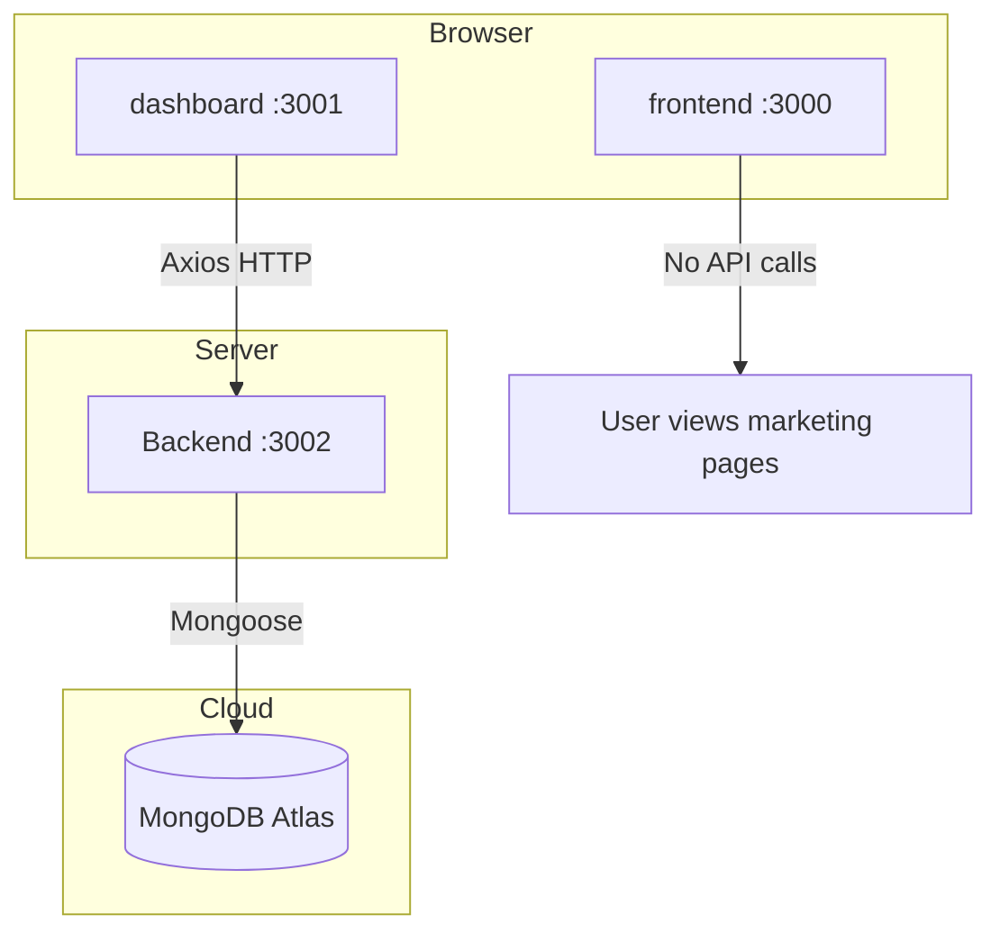

# Zerodha Clone — Full Project Documentation

A **full-stack MERN-style** clone inspired by [Zerodha](https://zerodha.com/). The project is split into three independent React/Node applications that work together: a **marketing website**, a **trading dashboard**, and a **REST API** backed by **MongoDB**.

This README explains what the project does, how each part works, where data is stored, how to run everything, and how to view data in the browser or database.

---

## Table of contents

1. [Overview](#overview)
2. [Features](#features)
3. [Architecture](#architecture)
4. [Project structure](#project-structure)
5. [How the project works](#how-the-project-works)
6. [Frontend (landing site)](#frontend-landing-site)
7. [Dashboard (trading app)](#dashboard-trading-app)
8. [Backend (API server)](#backend-api-server)
9. [MongoDB & data storage](#mongodb--data-storage)
10. [Viewing data (browser, API, Atlas)](#viewing-data-browser-api-atlas)
11. [API reference](#api-reference)
12. [Environment variables](#environment-variables)
13. [Installation & run commands](#installation--run-commands)
14. [Build for production](#build-for-production)
15. [npm scripts reference](#npm-scripts-reference)
16. [Troubleshooting](#troubleshooting)
17. [Tech stack](#tech-stack)
18. [Limitations & future improvements](#limitations--future-improvements)
19. [For new contributors](#for-new-contributors)

---

## Overview

| App | Folder | Port | URL | Role |
|-----|--------|------|-----|------|
| Landing site | `frontend/` | 3000 | http://localhost:3000 | Public pages: home, products, pricing, about, support, signup |
| Trading dashboard | `dashboard/` | 3001* | http://localhost:3001 | Logged-in-style UI: watchlist, holdings, orders, positions, funds |
| API server | `Backend/` | 3002 | http://localhost:3002 | Express REST API + MongoDB |

\*Use port **3001** for dashboard so it does not conflict with frontend on **3000**.

**Important:** The landing site and dashboard are **separate React apps**. They do not share code; only the dashboard talks to the backend API.

---

## Features

### Landing site (`frontend`)

- Zerodha-style home page (hero, awards, stats, pricing teaser, education)
- **Products** page — Kite, Console, Coin, etc.
- **Pricing** page — brokerage details
- **About** page — company / team
- **Support** page — help / tickets UI
- **Signup** page — account signup UI (no real backend auth wired)
- Global **Navbar** and **Footer** on all routes
- 404 page for unknown routes

### Dashboard (`dashboard`)

- **Watchlist** (left panel) — search, stock list, hover actions (Buy / Sell / Analytics)
- **Buy modal** — place a BUY order (saved to MongoDB via API)
- **Summary** — equity & holdings overview (static numbers)
- **Holdings** — live table + bar chart from **MongoDB**
- **Orders** — empty-state UI (orders are stored in DB when you buy; list view can be added)
- **Positions** — open positions table (static mock data)
- **Funds** — margin / cash breakdown (static UI)
- **Apps** — placeholder page
- Top bar with NIFTY / SENSEX indices (static)
- Side menu navigation between sections

### Backend (`Backend`)

- Connect to **MongoDB Atlas** (or local MongoDB) via `MONGO_URL`
- Auto-**seed** 13 sample holdings on first run
- **CORS** enabled for dashboard requests
- REST endpoints: holdings, orders, create order

---

## Architecture



**Data flow for holdings:**

```
MongoDB (holdings collection)
    → Backend GET /allHoldings
    → dashboard/src/Components/Holdings.js (Axios)
    → Table + Chart.js graph at /holdings
```

**Data flow for new orders:**

```
User clicks Buy in Watchlist
    → BuyActionWindow.js POST /newOrder
    → MongoDB (orders collection)
```

---

## Project structure

```
Zerodha_clone/
│
├── README.md                 # This documentation
├── .gitignore                # Ignores node_modules, .env
│
├── frontend/                 # Marketing / landing React app
│   ├── public/               # Static assets, Font Awesome, images
│   ├── src/
│   │   ├── index.js          # Routes + Navbar + Footer
│   │   ├── index.css
│   │   └── Landing_page/
│   │       ├── Navbar.js
│   │       ├── Footer.js
│   │       ├── OpenAccount.js
│   │       ├── NotFound.js
│   │       ├── Signup/
│   │       ├── Home/         # Hero, Awards, Stats, Pricing, Education
│   │       ├── products/
│   │       ├── pricing/
│   │       ├── about/
│   │       └── Support/
│   └── package.json
│
├── dashboard/                # Trading dashboard React app
│   ├── public/
│   ├── .env.example          # REACT_APP_API_URL template
│   ├── src/
│   │   ├── index.js          # Router → Home
│   │   ├── config.js         # API_BASE_URL
│   │   ├── data/data.js      # Mock watchlist, holdings, positions
│   │   └── Components/
│   │       ├── Home.js       # TopBar + Dashboard layout
│   │       ├── TopBar.js
│   │       ├── Menu.js       # Side navigation
│   │       ├── Dashboard.js  # Routes + WatchList wrapper
│   │       ├── WatchList.js
│   │       ├── Holdings.js   # Fetches from API
│   │       ├── BuyActionWindow.js
│   │       ├── GeneralContext.js
│   │       ├── Orders.js
│   │       ├── Positions.js
│   │       ├── Summary.js
│   │       ├── Funds.js
│   │       ├── Apps.js
│   │       ├── VerticalGraph.js
│   │       └── DoughnoutChart.js
│   └── package.json
│
└── Backend/                  # Node.js API
    ├── .env.example          # PORT, MONGO_URL template
    ├── server.js             # Express app, routes, DB connect, seed
    ├── package.json
    ├── model/
    │   ├── HoldingsModel.js
    │   └── OrdersModel.js
    ├── schemes/
    │   ├── HoldingsSchema.js
    │   └── OrdersSchema.js
    └── seed/
        └── holdingsSeed.js   # 13 default holdings
```

---

## How the project works

### End-to-end user journey

1. User visits **http://localhost:3000** → browses Zerodha-like marketing content.
2. User opens **http://localhost:3001** → sees the trading dashboard (watchlist + summary).
3. User opens **Holdings** → dashboard calls `GET /allHoldings` → table shows stocks from MongoDB.
4. User hovers a watchlist stock → **Buy** → enters qty/price → **Buy** → `POST /newOrder` → order document created in MongoDB.
5. Developer or user can verify data at **http://localhost:3002/allHoldings** or in **MongoDB Atlas**.

### What is dynamic vs static

| Feature | Dynamic (API / DB) | Static (hardcoded / data.js) |
|---------|-------------------|------------------------------|
| Holdings table | Yes | — |
| New orders (save) | Yes | — |
| Orders list UI | — | Yes (empty message only) |
| Watchlist | — | Yes |
| Positions | — | Yes |
| Summary / Funds | — | Yes |
| Landing pages | — | Yes (no CMS) |
| User login / signup | — | UI only (no auth API) |

### Authentication

`Backend/package.json` includes **Passport** packages, but **authentication is not implemented** in `server.js`. Signup on the frontend is visual only. Anyone with the dashboard URL can use the app.

---

## Frontend (landing site)

**Tech:** React 19, React Router 7, Create React App (`react-scripts`).

### Routes

| Path | Component | Description |
|------|-----------|-------------|
| `/` | `HomePage` | Hero, awards, stats, pricing block, education, open account CTA |
| `/signup` | `Signup` | Signup form UI |
| `/about` | `AboutPage` | About Zerodha-style content |
| `/product` | `ProductsPage` | Product showcase (Kite, etc.) |
| `/pricing` | `PricingPage` | Brokerage and charges |
| `/support` | `SupportPage` | Support / ticket UI |
| `*` | `NotFound` | 404 page |

### Layout

- `Navbar` and `Footer` wrap all routes in `src/index.js`.
- Styling: `src/index.css` + component-level styles.
- Assets: `public/media/`, Font Awesome in `public/font-awesome-4.7.0/`.

### Commands

```powershell
cd frontend
npm install
npm start          # Dev server → http://localhost:3000
npm run build      # Production build → frontend/build/
npm test           # Jest tests
```

---

## Dashboard (trading app)

**Tech:** React 18, React Router 6, Axios, Material UI (icons/tooltips), Chart.js + react-chartjs-2.

### Routes

| Path | Component | Data source |
|------|-----------|-------------|
| `/` | `Summary` | Static UI |
| `/orders` | `Orders` | Static “no orders today” message |
| `/holdings` | `Holdings` | **API → MongoDB** |
| `/positions` | `Positions` | `src/data/data.js` |
| `/funds` | `Funds` | Static UI |
| `/apps` | `Apps` | Placeholder |

`WatchList` is always rendered on the left (inside `GeneralContextProvider`).

### Key components

| File | Purpose |
|------|---------|
| `config.js` | `API_BASE_URL` from `REACT_APP_API_URL` (default `http://localhost:3002`) |
| `Holdings.js` | `useEffect` + Axios GET `/allHoldings`; renders table + `VerticalGraph` |
| `BuyActionWindow.js` | Modal; POST `/newOrder` on Buy |
| `GeneralContext.js` | Opens/closes buy window; passes selected stock symbol |
| `WatchList.js` | Renders `watchlist` array; Buy triggers context |
| `data.js` | Mock `watchlist`, `holdings`, `positions` arrays |

### Commands

```powershell
cd dashboard
npm install
copy .env.example .env    # Set REACT_APP_API_URL
$env:PORT="3001"
npm start                 # → http://localhost:3001
npm run build             # → dashboard/build/
```

---

## Backend (API server)

**Tech:** Node.js, Express 5, Mongoose 9, CORS, dotenv, nodemon (dev).

### `server.js` responsibilities

1. Load environment from `Backend/.env`.
2. Connect to MongoDB using `MONGO_URL`.
3. Run `seedHoldings()` — insert 13 holdings if collection is empty or fix invalid documents.
4. Start Express on `PORT` (default **3002**).
5. Register routes (see [API reference](#api-reference)).

### Models & collections

| Mongoose model | Collection name | Schema file |
|----------------|-----------------|-------------|
| `holding` | `holdings` | `schemes/HoldingsSchema.js` |
| `order` | `orders` | `schemes/OrdersSchema.js` |

### Holdings document fields

```js
{
  name: String,      // e.g. "INFY"
  qty: Number,
  avg: Number,       // average buy price
  price: Number,     // LTP (last traded price)
  net: String,       // e.g. "+15.18%"
  day: String,       // e.g. "-1.60%"
  isLoss: Boolean    // optional, for red/green day styling
}
```

### Order document fields

```js
{
  name: String,      // stock symbol
  qty: Number,
  price: Number,
  mode: String,      // "BUY" or "SELL"
  createdAt: Date    // auto default
}
```

### Commands

```powershell
cd Backend
npm install
copy .env.example .env    # Add your MONGO_URL
npm start                 # nodemon server.js → port 3002
```

---

## MongoDB & data storage

### Connection

Set in `Backend/.env`:

```env
PORT=3002
MONGO_URL=mongodb+srv://<user>:<password>@<cluster>/<database>?...
```

- Database name is the path in the URL (e.g. `Zerodha`).
- **Never commit** real credentials; use `.env.example` as a template.

### Collections

| Collection | When data is written | Sample count |
|------------|----------------------|--------------|
| `holdings` | Server startup (seed) | 13 stocks |
| `orders` | Each successful `POST /newOrder` | 0+ |

### Seed data

File: `Backend/seed/holdingsSeed.js`

Includes: BHARTIARTL, HDFCBANK, HINDUNILVR, INFY, ITC, KPITTECH, M&M, RELIANCE, SBIN, SGBMAY29, TATAPOWER, TCS, WIPRO.

If old broken documents exist (missing `name`), restart the backend — it deletes and re-seeds automatically.

### What is **not** in MongoDB

- Watchlist items (`dashboard/src/data/data.js`)
- Positions (`data.js`)
- Summary / Funds numbers
- Landing page content

---

## Viewing data (browser, API, Atlas)

### Dashboard UI

| What | URL |
|------|-----|
| Holdings table + chart | http://localhost:3001/holdings |
| Place order | http://localhost:3001 → watchlist → Buy |
| Summary | http://localhost:3001/ |
| Positions (mock) | http://localhost:3001/positions |

### Raw JSON in browser

| URL | Returns |
|-----|---------|
| http://localhost:3002/allHoldings | All holdings |
| http://localhost:3002/allOrders | All orders |

### MongoDB Atlas

1. Login: https://cloud.mongodb.com/
2. Cluster → **Browse Collections**
3. Database: name from your `MONGO_URL` (e.g. `Zerodha`)
4. Collections: `holdings`, `orders`

### PowerShell

```powershell
Invoke-RestMethod http://localhost:3002/allHoldings | ConvertTo-Json -Depth 5
Invoke-RestMethod http://localhost:3002/allOrders | ConvertTo-Json -Depth 5
```

### curl

```bash
curl http://localhost:3002/allHoldings
curl http://localhost:3002/allOrders
```

---

## API reference

**Base URL:** `http://localhost:3002` (or `PORT` in `.env`)

| Method | Endpoint | Description | Response |
|--------|----------|-------------|----------|
| `GET` | `/allHoldings` | List all holdings | JSON array |
| `GET` | `/allOrders` | List orders (newest first) | JSON array |
| `POST` | `/newOrder` | Create order | `201` + order object |

### POST `/newOrder`

**Headers:** `Content-Type: application/json`

**Body:**

```json
{
  "name": "INFY",
  "qty": 1,
  "price": 1555.45,
  "mode": "BUY"
}
```

**PowerShell example:**

```powershell
$body = @{ name = "INFY"; qty = 1; price = 1555.45; mode = "BUY" } | ConvertTo-Json
Invoke-RestMethod -Uri http://localhost:3002/newOrder -Method Post -Body $body -ContentType "application/json"
```

**curl (Windows CMD):**

```bash
curl -X POST http://localhost:3002/newOrder -H "Content-Type: application/json" -d "{\"name\":\"INFY\",\"qty\":1,\"price\":1555,\"mode\":\"BUY\"}"
```

---

## Environment variables

### `Backend/.env`

```env
PORT=3002
MONGO_URL=your_mongodb_connection_string
```

Copy template:

```powershell
copy Backend\.env.example Backend\.env
```

### `dashboard/.env`

```env
REACT_APP_API_URL=http://localhost:3002
```

Copy template:

```powershell
copy dashboard\.env.example dashboard\.env
```

`REACT_APP_API_URL` must match backend `PORT`. Restart dashboard after changing `.env`.

### `frontend`

No `.env` required for basic use. Optional: add `REACT_APP_*` variables if you later connect signup to an API.

---

## Installation & run commands

### Prerequisites

- [Node.js](https://nodejs.org/) 18+ (LTS recommended)
- npm
- MongoDB Atlas account **or** local MongoDB
- Network access whitelisted in Atlas (IP allowlist)

### One-time setup

```powershell
# From project root
cd Backend
npm install
copy .env.example .env
# Edit .env with your MONGO_URL

cd ..\frontend
npm install

cd ..\dashboard
npm install
copy .env.example .env
```

### Run all three apps (3 terminals)

**Terminal 1 — Backend**

```powershell
cd Backend
npm start
```

Expected output:

```
MONGODB CONNECTED SUCCESSFULLY
Holdings seeded          # (only first time or after reset)
App Started on Port 3002
```

**Terminal 2 — Frontend**

```powershell
cd frontend
npm start
```

→ http://localhost:3000

**Terminal 3 — Dashboard**

```powershell
cd dashboard
$env:PORT="3001"
npm start
```

→ http://localhost:3001

### Quick verification checklist

- [ ] http://localhost:3002/allHoldings returns JSON with 13 items
- [ ] http://localhost:3001/holdings shows the table
- [ ] http://localhost:3000 loads the home page
- [ ] Buy from watchlist → http://localhost:3002/allOrders shows new order

---

## Build for production

```powershell
cd frontend
npm run build
# Output: frontend/build/

cd ..\dashboard
npm run build
# Output: dashboard/build/

cd ..\Backend
# Run with node (no nodemon):
node server.js
```

Serve `frontend/build` and `dashboard/build` with any static host (Netlify, Vercel, Nginx). Deploy `Backend` to Render, Railway, etc. Set production `MONGO_URL` and `REACT_APP_API_URL` to your live API URL.

---

## npm scripts reference

| Folder | Command | Description |
|--------|---------|-------------|
| **Backend** | `npm start` | Start API with nodemon |
| **frontend** | `npm start` | Dev server (port 3000) |
| **frontend** | `npm run build` | Production build |
| **frontend** | `npm test` | Run tests |
| **dashboard** | `npm start` | Dev server (set PORT=3001) |
| **dashboard** | `npm run build` | Production build |
| **dashboard** | `npm test` | Run tests |

---

## Troubleshooting

| Problem | Possible cause | Solution |
|---------|----------------|----------|
| `Network Error` / AxiosError | Backend not running or wrong URL | Start Backend; check `dashboard/.env` → `http://localhost:3002` |
| Empty holdings table | API returns `[]` or failed seed | Open `/allHoldings`; restart backend |
| `MONGODB CONNECTION FAILED` | Wrong URL or IP not whitelisted | Fix `MONGO_URL`; Atlas → Network Access → add IP |
| Port 3000 in use | Frontend + dashboard both default to 3000 | Use `$env:PORT="3001"` for dashboard |
| Holdings have only `_id` in DB | Old broken schema | Restart backend (auto re-seed) |
| CORS error | Rare if using correct API URL | Backend already uses `cors()` |
| `.env` changes ignored (dashboard) | CRA caches env at start | Stop and restart `npm start` |

---

## Tech stack

| Layer | Technologies |
|-------|----------------|
| Landing UI | React 19, React Router 7, CSS |
| Dashboard UI | React 18, React Router 6, Axios, MUI 5, Chart.js 4 |
| API | Node.js, Express 5, Mongoose 9, CORS, dotenv |
| Database | MongoDB (Atlas recommended) |
| Dev tools | Create React App, nodemon |

---

## Limitations & future improvements

Current scope is **learning / demo**, not production trading.

| Area | Current state | Possible improvement |
|------|---------------|-------------------|
| Authentication | Not implemented | Passport + JWT / sessions |
| Orders page | Static empty UI | Fetch `GET /allOrders` and display table |
| Positions | Mock data | `PositionsModel` + API like holdings |
| Watchlist | Static | Save per-user watchlist in DB |
| Sell orders | Button only | Wire Sell to `POST /newOrder` with `mode: "SELL"` |
| Live prices | Static numbers | Stock price API (e.g. Yahoo Finance) |
| Frontend signup | UI only | Connect to auth API |
| Holdings update | Seed only | CRUD APIs for admin |
| Tests | Default CRA tests | API integration tests |

---

## For new contributors

1. **Clone** the repository.
2. Copy `Backend/.env.example` → `Backend/.env` and add your MongoDB URL.
3. Copy `dashboard/.env.example` → `dashboard/.env`.
4. Run `npm install` in `Backend`, `frontend`, and `dashboard`.
5. Start **Backend** first, then **dashboard**, then **frontend**.
6. Read this README sections [Architecture](#architecture) and [MongoDB](#mongodb--data-storage).
7. Do not commit `.env` files or database passwords.

---

## Summary

| Question | Answer |
|----------|--------|
| What does this project do? | Zerodha-style website + trading dashboard + API |
| Where is real data stored? | MongoDB: `holdings` and `orders` |
| How do I see holdings on screen? | http://localhost:3001/holdings |
| How do I see raw DB data? | Atlas UI or http://localhost:3002/allHoldings |
| What commands do I run? | `npm install` then `npm start` in each folder (see above) |

For questions or issues, refer to the [Troubleshooting](#troubleshooting) section or inspect `Backend/server.js` and `dashboard/src/Components/Holdings.js` for the main data flow.
